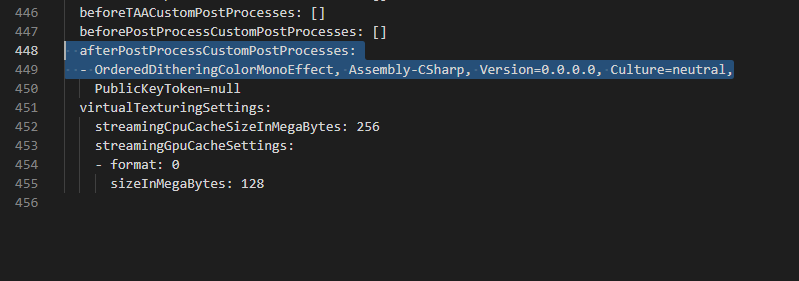

# HPSX-HDRP-Toolkit
The haunted psx HDRP volume shader.

This shader is based on: https://github.com/o-l-l-i/OrderedDitheringMonoChannel

It adds a few extra features such as limiting number of steps in each RGB channel and seperation amount.

This pack also includes the shader graph tools ported over from URP repo and Kodrin's repo:
https://github.com/Kodrin/URP-PSX

Shader graph tools are still WIP, but you should be able to tweak it to work in most cases. Still not a good way to do affine texture wrapping, probably have to keep looking around for good methods on that... let me know if anyone finds a good way to do it in shader graph.

# Migration
Migration to newer or older versions of HDRP (at least 2019 LTS should work) is a little wierd since the feature was somewhat removed from the pipeline(I think). However, it is as simple as adding to the `afterPostProcessCustomPostProcesses:` line in the HDRPRenderPipeline asset with the custom volume pass name.

# URP
Refer to this repo for URP stuff.
https://github.com/RubenTipparach/HPSXURP-Shader-Graph-Tools
